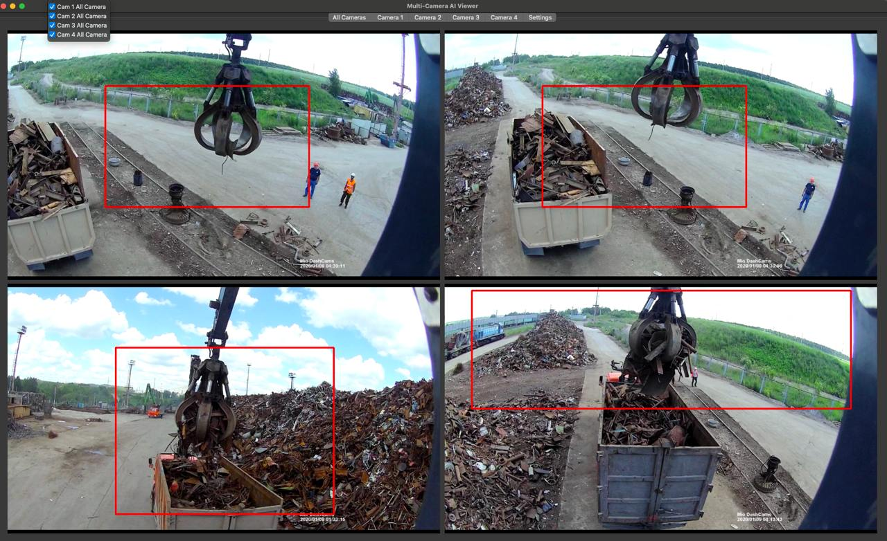
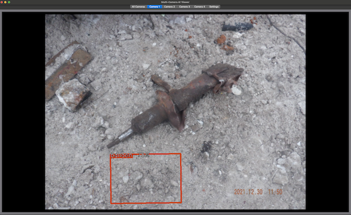
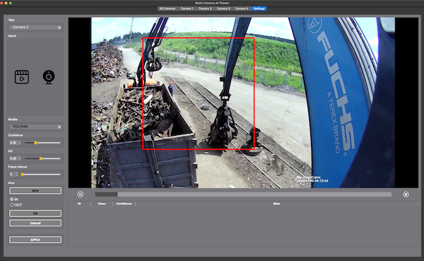

# Advanced Video Processing Application

- Author: `Oleg Shamaev`
- GUI Framework: `PyQt6`
- Processing `Framework: Ultralytics`

### Description in Russian [docs/docs/index.md](docs/docs/index.md)
### Installation and Configuration Guide [docs/docs/getting-started.md](docs/docs/getting-started.md)
### A guide to creating a documentation site [docs/README-DOCS.md](docs/README-DOCS.md)

## DESCRIPTION:

- This is a powerful and flexible application developed using PyQt6, designed for real-time processing of 4 video streams using the YOLOv8-OBB model.

- The application supports video processing from cameras, video files, and YouTube streams, providing highly efficient object detection and result saving.

- It is aimed at users who require accurate and fast video data processing for analytics and monitoring.

    - Interface Structure:
        - `All Cameras`: Tab for displaying all cameras simultaneously. Allows monitoring all video streams in one window.

        

        - `Camera` 1-4: Individual tabs for each camera.

         

        - `Settings`: Video stream settings tab. Allows configuring detection, recording, and interface parameters.

        


- Key Features:

    - Multi-Camera Processing:
        - The application provides 6 tabs.
        - The first tab displays all cameras simultaneously (`All Camera`)
        - The next four tabs are designed for working with each camera individually.        
        - The last tab is used for parameter `settings`.

    - Load Optimization:
        - Video processing is only performed on the active tab, reducing system load.
        - On the `All Cameras` tab, all cameras are processed simultaneously.
        - On the Settings tab, processing of all cameras is paused.
        - The video processing is only performed on the currently selected camera tab.

    - Session Saving:
        - The settings from the last session are saved and restored upon the next launch.
        - The application remembers the last opened tab and restores it upon restart.

    - Logging:
        - The application maintains a detailed log file, enabling tracking of operations and error detection.

    - YOLOv8-OBB Model Integration:
        - The OBB (Oriented Bounding Box) model is connected and configured for accurate object detection.

    - Frame Interval Processing:
        - The application allows setting a Frame Interval to skip frames, reducing processing load.

    - Result Recording:
        - Detection results can be recorded in a PostgreSQL database or in files compatible with YOLOv6-OBB (labels.txt and images.jpeg).
        - Recording can be configured based on the model's confidence threshold.

    - Detection Management:
        - The ability to enable or disable detection for each process on the All Cameras tab.
        - Supports selecting a detection area with the option to configure processing inside or outside the selected area.

    - Configuration File:
        - The application uses a JSON configuration file, allowing flexible settings for:
            - Visibility of the settings tab.
            - Method of saving results (to database or file).
            - Confidence threshold for recording.
            - Use of the model's confidence threshold for recording.

    - Customization for Client Needs:
        - The application has been adapted and refined to meet the specific requirements and tasks of the client.


---------------------------------------------------------------------------------------------------------------
## Project Organization
<a target="_blank" href="https://cookiecutter-data-science.drivendata.org/">
    
</a>

```
├── main.py            <- This is the main entry point of the project.
├── LICENSE            <- Open-source license if one is chosen
├── Makefile           <- Makefile with convenience commands like `make db' and other
├── README.md          <- The top-level README for developers using this project.
├── data
│   ├── db_image       <- Data Base images.
│   ├── images         <- Images.
│   ├── labels         <- Labels.
│   └── video          <- start video and other video.
│
├── docs               <- A default mkdocs project; see mkdocs.org for details
│   ├── docs           <- Docs .md files
|   ├── mkdocs.yml     <- Configuration file MkDocs
|   ├── README-DOCS.md <- README MkDocs use
|   ├── ui
|   └── utils
├── logs               <- Logs
|
├── models             <- Classes and models
|    └──weights        <- Trained and serialized models, model predictions, or model summaries
│
├── notebooks          <- Jupyter notebooks. Naming convention is a number (for ordering),
│                         the creator's initials, and a short `-` delimited description, e.g.
│                         `1.0-jqp-initial-data-exploration`.
│
├── pyproject.toml     <- Project configuration file with package metadata for project
│                         and configuration for tools like black
│
├── src                <- Modules
│   ├── data_type
|   ├── models
|   ├── qt
|   ├── ui
|   └── utils
|
├── reports            <- Generated analysis as HTML, PDF, LaTeX, etc.
│   └── figures        <- Generated graphics and figures to be used in reporting
│
├── requirements.txt   <- The requirements file for reproducing the analysis environment, e.g.
│                         generated with `pip freeze > requirements.txt`
│
├── setup.cfg          <- Configuration file for flake8, black, isort
```

---------------------------------------------------------------------------------------------------------------


